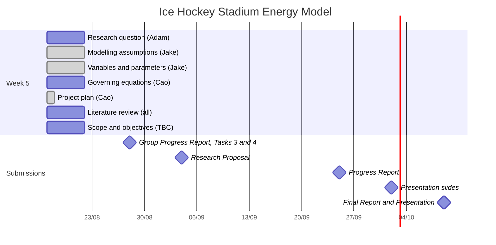

# Project Plan — Key Activities and Timeline

**Project:** Powered heating and cooling model of buildings — case study: an ice hockey stadium
**Group:** Bui Duc Minh Cao, Jake Pedersen, Adam Zaltsman
**Version:** Draft 4 — 24/08/2026

> Dates below are the Friday of each teaching week, derived from the Week 2–4
> meeting sequence (31/07, 07/08, 14/08). **To be checked against the unit outline**
> in case a mid-semester break shifts them.

## 1. Milestones

| Deliverable | Week | Date | Length |
| --- | --- | --- | --- |
| Group Progress Report — Tasks 3 & 4 | 6 | Fri 28/08/2026, 11:59 PM | — |
| Research Proposal | 7 | Fri 04/09/2026 | 4–6 pages |
| Progress Report | 10 | Fri 25/09/2026 | 5–8 pages |
| Presentation slides | 11 | Fri 02/10/2026 | 10–12 slides |
| Final Report + Presentation | 12 | Fri 09/10/2026 | 15–25 pages |

## 2. Weekly Timeline

| Week | Date | Activities | Owner |
| --- | --- | --- | --- |
| 5 | 21/08 | Clearly define the research question | Adam |
| | | Preliminary modelling assumptions | Jake |
| | | Identification of main variables and parameters | Jake |
| | | Initial mathematical model / governing equations | Cao |
| | | Prepare a clear project plan outlining key activities and timeline | Cao |
| | | Review relevant literature related to the project topic | Adam, Cao, Jake |
| | | Define project scope and objectives | TBC |
| | | Compile physical parameter table | TBC |

## 3. Gantt Chart

